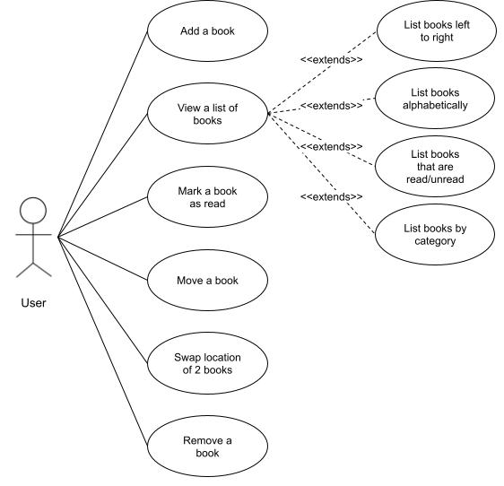
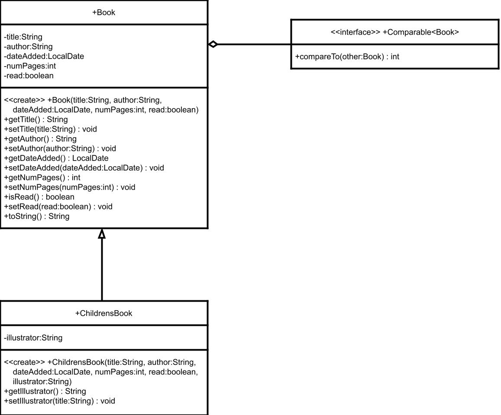

## About the Project

Tell the employer about the assignment. What things did you learn?

## Use Cases

- As a user, I want to add books to a bookshelf.
- As a user, I want to view a list of books on the bookshelf (in order left to right, alphabetically, read/unread, by category).
- As a user, I want to modify a book as read
- As a user, I want to move a book to a specific location on the bookshelf.
- As a user, I want to swap the position of books on the bookshelf.
- As a user, I want to remove a book from the bookshelf.

## Class Diagram

